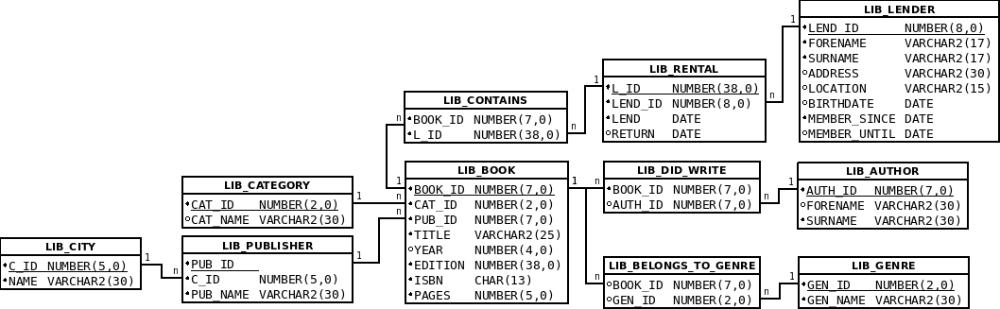

# Tutorium - Grundlagen Datenbanken - Blatt 8

## Vorbereitung

* Für dieses Aufgabenblatt wird die SQL-Dump-Datei ```Tutorium_Book.sql``` benötigt, die sich in dem Verzeichnis ```sql``` befindet
* Die SQL-Dump Datei wird in SQL-PLUS mittels ```start <Dateipfad> ```  in Datenbank   importieren
* Beispiele
*  Linux: ```start ~/Tutorium_Book.sql```
*  Windows: ```start C:\Users\max.mustermann\Desktop\Tutorium_Book.sql```

### Datenbankmodell


### Aufgabe 1
Was bewirkt die folgende Prozedur?

```sql
CREATE OR REPLACE PROCEDURE get_cat_name(in_book_id IN NUMBER, out_cat_name OUT VARCHAR2)
AS
  v_cat_name lib_category.cat_name%TYPE;
BEGIN
  SELECT cat_name INTO v_cat_name
  FROM lib_book b
    INNER JOIN lib_category c ON (b.cat_id = c.cat_id)
  WHERE book_id = in_book_id;

  out_cat_name := v_cat_name;
EXCEPTION
  WHEN NO_DATA_FOUND THEN
    RAISE_APPLICATION_ERROR(-20009,'Buch nicht vorhanden');
  WHEN OTHERS THEN
    RAISE_APPLICATION_ERROR(-20010,'proc:get_cat_name: ' || substr(SQLERRM,1,80));
END;
```

#### Lösung
Diese Prozedur erhält einen `INPUT` Parameter vom Datentyp `NUMBER`. Diesem `INPUT` Parameter wird eine Buch-ID übergeben. Mittels Buch-ID wird die zugewiesene Kategorie des Buches ermittelt im BEGIN Block der Prozedur ermittelt. Über den `OUTPUT` Parameter wird diese Kategorie in einem `VARCHAR2` Datentyp zurückgegeben. Gibt es keine Buch-ID bzw. kein passenden Datensatz zu dieser ID so wird eine Exception im Fehlerblock geworfen (`NO DATA FOUND`). Jeder andere Fehler der bei dieser Prozedur gefunden wird, wird unter dem Exception-Block `Others` behandelt.

### Aufgabe 2
Schreibe eine Prozedur, die bei Eingabe einer `lend_id` (IN-Parameter) das aktuellste Ausleihdatum für diesen Kunden zurückgibt (OUT-Parameter). Rufe die Prozedur auf und lasse dir das aktuellste Ausleihdatum für den Kunden mit der `lend_id` `3` ausgeben (mithilfe von PL/SQL oder über SQLPlus).

#### Lösung
```sql
CREATE OR REPLACE PROCEDURE get_max_date(in_lend_id IN NUMBER, out_max_date OUT DATE )
AS
  v_max_date lib_rental.lend%TYPE;
BEGIN
  SELECT MAX(lend) INTO v_max_date
  FROM lib_rental
  WHERE lend_id = in_lend_id;
  out_max_date := v_max_date;
EXCEPTION
  WHEN OTHERS THEN
    RAISE_APPLICATION_ERROR(-20010,'proc' || 'get_max_date: ' || SUBSTR(SQLERRM,1,80));
END;

-- Anzeige über PL/SQL
DECLARE
  v_dat date;
BEGIN
  get_max_date (3, v_dat);
  dbms_output.put_line(v_dat);
END;

-- Anzeige über SQL-PLUS
var v_dat varchar2(30)
exec get_max_date(3,:v_dat)
print :v_dat
```

### Aufgabe 3
Was bewirkt die folgende Funktion?

```sql
CREATE OR REPLACE FUNCTION get_c_name(in_pub_id IN NUMBER) RETURN VARCHAR2
AS
  v_c_name lib_city.name%TYPE;
BEGIN
  SELECT c.name INTO v_c_name
  FROM lib_city c
    INNER JOIN lib_publisher p ON (c.c_id = p.c_id)
  WHERE pub_id = in_pub_id;

  RETURN v_c_name;

EXCEPTION
  WHEN NO_DATA_FOUND THEN
    RAISE_APPLICATION_ERROR(-20009,'Publisher nicht vorhanden');
  WHEN OTHERS THEN
    RAISE_APPLICATION_ERROR(-20010,'proc' || 'get_cat_name: '|| SUBSTR(SQLERRM,1,80));
END;
```

#### Lösung
Die Funktion `get_c_name` such anhand der `INPUT` Variable `in_pub_id` vom Datentyp `NUMBER` die Stadt des Verlages herraus, wobei die Verlags-ID (Publisher-ID) über den `INPUT` Wert übergeben wird. Die Funktion hat keinen `OUTPUT` Datentyp, der gefundene String mit Inhalt der Heimatstadt des Verlegers wird mittels RETURN zurück gegeben.

### Aufgabe 4
Schreibe eine PL/SQL-Funktion, die bei Eingabe einer Autor-ID die insgesamt veröffentlichten Seiten des Autors ausgibt. Baue deine Funktion so in eine Select-Abfrage ein, dass du eine Liste aller Autoren (`forename` und `surname`) inklusive der vom jeweiligen Autor insgesamt veröffentlichten Seiten erhältst.

#### Lösung
```sql
CREATE OR REPLACE FUNCTION get_sum_pages(in_auth_id IN NUMBER) RETURN number
AS
  v_sum_pages number;
BEGIN
  SELECT SUM(b.pages) INTO v_sum_pages
  FROM lib_did_write c
    INNER JOIN  lib_book b ON (c.book_id = b.book_id)
  WHERE     c.auth_id = in_auth_id;

  return v_sum_pages;
EXCEPTION
  WHEN OTHERS THEN
    RAISE_APPLICATION_ERROR(-20010,'proc' || 'get_cat_name: '|| SUBSTR(SQLERRM,1,80));
END;


SELECT forename, surname, get_sum_pages(auth_id) SUM
FROM lib_author;

```
